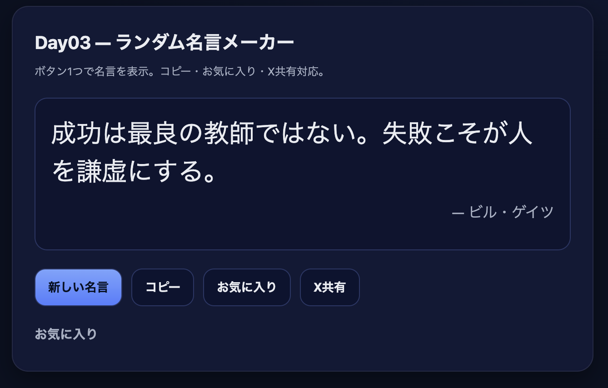

# Day03 — ランダム名言メーカー / Random Quote Maker

ボタン1つで名言をランダム表示できるWebアプリです。  
コピー・お気に入り保存・X共有にも対応しています。  

A simple web app that displays random quotes with just one click.  
Supports **copy to clipboard**, **favorites (saved in LocalStorage)**, and **share to X (Twitter)**.  

---

## 機能 / Features
- ランダムに名言を表示  
- 直前と同じ名言は表示されにくい工夫あり  
- コピー機能（クリップボードに保存）  
- お気に入り登録（LocalStorageで保存）  
- X共有ボタン（ハッシュタグ付き）  

- Display random quotes from a predefined list  
- Avoid showing the same quote consecutively  
- Copy quotes to the clipboard  
- Add/remove favorites (persisted in LocalStorage)  
- Share quotes directly to X with hashtags  

---

## 技術スタック / Tech Stack
- HTML / CSS / JavaScript（Vanilla）  
- GitHub Pages で公開  

- HTML / CSS / Vanilla JavaScript  
- Deployed on GitHub Pages  

---

## デモ / Demo
👉 https://toy-abz.github.io/app-003-quote-maker/

---

## スクリーンショット / Screenshots

